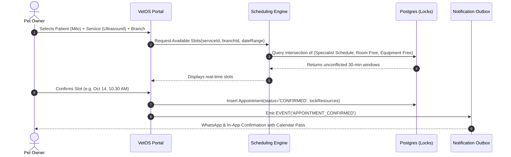

# VetOS — User Flows & State Machines (`USER_FLOWS.md`)

## 1. Overview of Core Interaction Cycles

This document formalizes the step-by-step state transitions and user journeys connecting Pet Owners, Receptionists, Veterinarians, Nurses, and Pharmacists.

---

## 2. Flow A: Smart Resource-Aware Appointment Booking



---

## 3. Flow B: Reception Check-In & Live Triage Queue

### 3.1 Queue State Machine
```
[APPOINTMENT: CONFIRMED]
           │
           ▼ (Tutor arrives at clinic)
     [CHECKED_IN] ──> Enters Live Queue (Status: WAITING)
           │
           ├── Triage Review by Staff (ROUTINE / PRIORITY / EMERGENCY)
           │
           ▼ (Doctor clicks "Llamar a Box")
   [IN_CONSULTATION] ──> Room Display Updates
           │
           ├── Doctor requests diagnostics? ──> [LAB / IMAGING QUEUE]
           │
           ▼
       [PAYMENT] ──> Cashier Settlement & Invoice Generation
           │
           ▼
      [FINISHED] ──> Patient departs / History archived
```

---

## 4. Flow C: Veterinarian Consultation & Longitudinal Timeline

1. **Patient Call:** Doctor clicks *"Llamar a Box 2"* from the live queue. Audio chime and digital display notify the waiting room.
2. **Clinical Workspace Loading:**
   * One-click summary: age, weight history curve, active allergies, chronic conditions, and last 3 timeline events.
   * Selection of clinical template (e.g. *Dermatología Canina*).
3. **Examination & Documentation:**
   * Temperature, Heart Rate, Respiration Rate, BCS (1-9).
   * Free-text anamnesis and structured symptom tags.
   * Dual diagnosis: Presumptive and Confirmed (ICD-Vet classification).
4. **Prescription Generation:**
   * Doctor adds medications. System auto-checks against patient's recorded allergies.
   * Doctor cryptographically signs prescription.
5. **Timeline Auto-Population:**
   * Atomic commit writes `consultations`, `prescriptions`, and `timeline_events` in one transaction.

---

## 5. Flow D: Diagnostic Laboratory Lifecycle

```
[ORDERED] (Vet orders CBC + Renal Profile)
    │
    ▼
[SAMPLE_PENDING] (Phlebotomy order sent to prep room)
    │
    ▼
[SAMPLE_COLLECTED] (Barcoded tube scanned by assistant)
    │
    ▼
[PROCESSING] (In-house analyzer or external lab courier)
    │
    ▼
[RESULT_AVAILABLE] (Lab tech inputs numerical values + attaches PDF)
    │
    ▼
[REVIEWED] (Attending Vet reviews flags, adds interpretation & signs)
    │
    └──> Auto-appends to Patient Medical Timeline + Notifies Tutor
```

---

## 6. Flow E: Inpatient Hospitalization & Scheduled Nursing Rounds

1. **Admission:** Doctor creates inpatient record, assigning a cage in *Ward A (Canine Observation)*.
2. **Clinical Task Generation:** Doctor sets treatment schedule:
   * `08:00`: IV Ampicillin 500mg
   * `10:00`: Temperature & Respiratory check
   * `12:00`: Low-fat gastrointestinal feeding
   * `14:00`: Pain score & wound inspection
3. **Nursing Execution Round:**
   * Nurse carries tablet through ward.
   * Scans patient kennel QR code.
   * Taps task: marks `DONE`, `SKIPPED`, or `DELAYED` with rationale.
   * Timestamped audit log created automatically.
4. **Discharge:** Doctor completes discharge report, auto-generating home care instructions for the pet owner.

---

## 7. Flow F: Pharmacy Dispensing from Electronic Prescription

```
Doctor Signs Electronic Prescription
                 │
                 ▼
Appears in Pharmacy Dispensary Queue
                 │
                 ▼
Pharmacist scans medication barcode
                 │
                 ├── System verifies Batch Number & Expiration Date
                 ├── Sufficient stock available?
                 │     ├── YES: Decrements inventory, logs `DISPENSE` transaction
                 │     └── NO: Triggers urgent purchase order / partial dispensation
                 │
                 ▼
Items marked as dispensed with patient name & dose instructions printed
```
